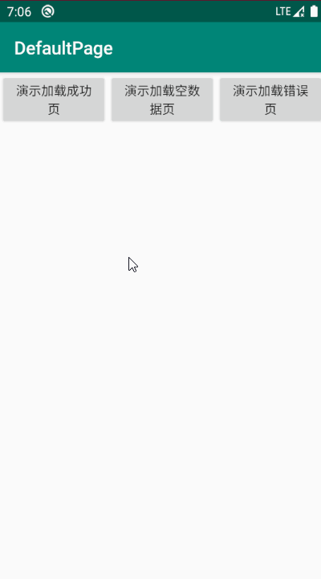
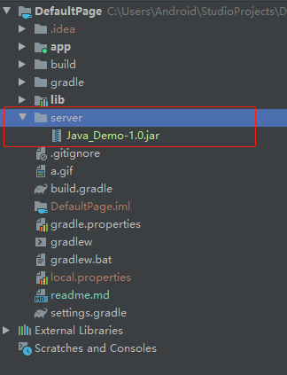
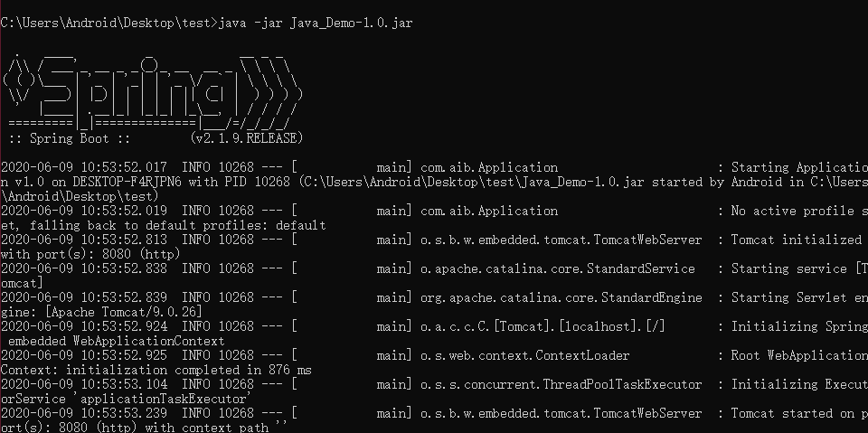

# Android缺省页控件封装



## 引入

Add it in your root build.gradle at the end of repositories:
```groovy
	allprojects {
		repositories {
			...
			maven { url 'https://jitpack.io' }
		}
	}
```
Step 2. Add the dependency
```groovy
	dependencies {
	        implementation 'com.github.hisgod:DefaultPage:0.0.4'
	}
```

# Client端

# 初始化

请在Application子类内进行初始化，设置加载中页面，加载空页面，加载失败页全局布局样式，如果某个页面某个页面不同，可在XML布局加上特有的页面

```kotlin
class PageApplication : Application() {
    override fun onCreate() {
        super.onCreate()

        //初始化全局布局文件
        DefaultPage.init(R.layout.load, R.layout.empty, R.layout.error)
    }
}
```

## 支持属性

| 属性             | 作用   |
| ---------------- | ------ |
| app:empty_layout | 空页面 |
| app:error_layout | 错误页 |
| app:load_layout  | 加载页 |

### 使用默认缺省页

在XML添加DefaultView即可，下面是不设置自定义缺省页，库会采取默认的缺省页

```xml
    <com.aib.view.DefaultView
        android:id="@+id/dv"
        android:layout_width="match_parent"
        android:layout_height="0dp"
        android:layout_weight="1">

        <TextView
            android:id="@+id/tv"
            android:layout_width="wrap_content"
            android:layout_height="wrap_content"
            android:layout_gravity="center"
            tools:text="APP" />
    </com.aib.view.DefaultView>
```

### 使用自定义缺省页

```xml
<?xml version="1.0" encoding="utf-8"?>
<com.aib.view.DefaultView xmlns:android="http://schemas.android.com/apk/res/android"
    xmlns:app="http://schemas.android.com/apk/res-auto"
    xmlns:tools="http://schemas.android.com/tools"
    android:id="@+id/dv"
    android:layout_width="match_parent"
    android:layout_height="match_parent"
    app:empty_layout="@layout/empty"
    app:error_layout="@layout/error"
    app:load_layout="@layout/load">
	...
</com.aib.view.DefaultView>
```

> 错误页XML布局需要特殊处理

**由于显示错误页，并提供回调，每次对控件进行设置点击事件，会比较繁琐，此处封装好id一定为`retry`控件的点击事件，所以自定义错误页，布局内一定要加上id**

```kotlin
    /**
     * 显示错误页，并提供回调
     */
    fun showError(callback: () -> Unit) {
        showError()
        try {
            errorView.findViewById<View>(R.id.retry)
                    .setOnClickListener {
                        callback()
                    }
        } catch (e: Exception) {
            Log.e(TAG, "重试控件ID必为<retry>")
        }
    }
```

> 错误页示范

```xml
<?xml version="1.0" encoding="utf-8"?>
<!--根布局设置了retry作为id，显示错误页时，点击页面即可响应回调-->
<RelativeLayout xmlns:android="http://schemas.android.com/apk/res/android"
    android:id="@+id/retry"
    android:layout_width="match_parent"
    android:layout_height="match_parent">

    <TextView
        android:id="@+id/tv_error_tip"
        android:layout_width="wrap_content"
        android:layout_height="wrap_content"
        android:layout_centerInParent="true"
        android:layout_gravity="center"
        android:text="加载出错" />
</RelativeLayout>
```

# Server端



## 说明

Demo包含的接口，都是自己写的，进行测试的，需要跑起服务端，才能访问数据，**注意URL中的地址，请填写本机IP**

## 使用

**PC安装Java环境，直接执行JAR包**，出现下图说明启动成功

